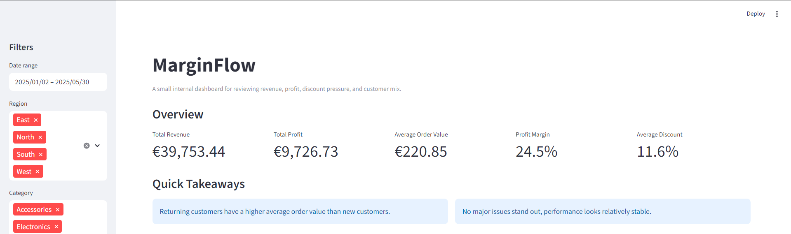
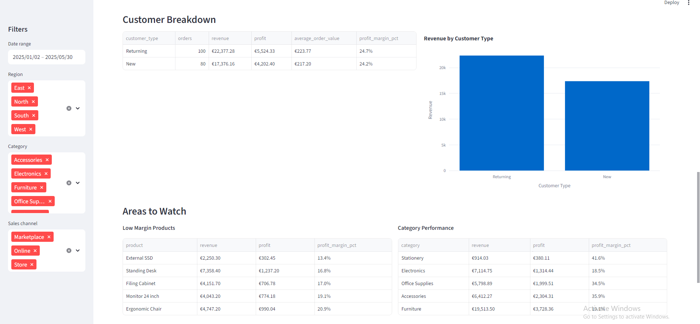

# MarginFlow



MarginFlow is a small internal dashboard for reviewing retail performance with a focus on revenue quality, profit margin, discount pressure, and customer mix.

It is intentionally scoped like a practical internal tool rather than a polished SaaS product. The goal is to show clear thinking, useful reporting, and clean presentation without overbuilding the project.

---

## Highlights

- Tracks revenue, profit, margin, and discount pressure in one compact dashboard
- Uses rule-based takeaways to surface what stands out in the filtered data
- Built as a practical internal analytics tool with Streamlit, Pandas, and Plotly

---

## Why this project exists

Many beginner dashboards stop at “sales went up or down”.

MarginFlow goes further by focusing on **how healthy that growth actually is**.

It helps answer:

- Is revenue growing faster than profit?
- Are discounts improving volume but hurting margins?
- Which products sell well but contribute little profit?
- Are returning customers more valuable?
- Which regions or categories need attention?

---

## Features

### Overview KPIs
- Total Revenue  
- Total Profit  
- Average Order Value  
- Profit Margin %  
- Average Discount %  

### Filters
- Date range  
- Region  
- Category  
- Sales channel  

### Visuals
- Revenue over time  
- Profit over time  
- Top products by revenue  
- Top products by profit  
- Revenue by customer type  

### Business Insights
- Quick Takeaways (rule-based insights)
- Low margin products  
- High discount impact products  
- Category performance  
- Region performance  

---

## Dashboard Analysis View



---

## Tech Stack

- Python  
- Streamlit  
- Pandas  
- Plotly  

---

## Project Structure

```
marginflow/
├── app.py
├── requirements.txt
├── README.md
├── data/
│   └── retail_orders.csv
├── src/
│   ├── __init__.py
│   ├── data_loader.py
│   ├── metrics.py
│   ├── insights.py
│   └── charts.py
└── assets/
    ├── preview.png
    └── analysis-view.png
```

---

## How to Run

```bash
git clone https://github.com/SlavchoVlakeskiGit/marginflow.git
cd marginflow
pip install -r requirements.txt
py -m streamlit run app.py
```

---

## Dataset

The project uses a synthetic retail dataset with fields such as:

- order_date  
- order_id  
- product  
- category  
- region  
- sales_channel  
- units_sold  
- unit_price  
- discount_pct  
- revenue  
- cost  
- profit  
- customer_type  

The dataset is designed to be simple but realistic enough for meaningful analysis.

---

## What this project demonstrates

This project complements backend-heavy work by showing:

- Business thinking (not just coding)
- KPI design and interpretation
- Data transformation with Pandas
- Clean, readable dashboard UI
- Practical insight generation
- Turning raw data into decisions

---

## Implementation Notes

- The dataset is synthetic and included to make the dashboard easy to run locally

- Quick Takeaways are based on simple reporting logic, not machine learning

- The scope is intentionally small to keep the tool focused and believable

- The app is designed to feel like an internal reporting dashboard, not a full BI platform

---

## Design choices

Deliberately excluded:

- Machine learning  
- Forecasting  
- Authentication  
- Database setup  
- Multi-page navigation  
- Overly complex UI  

The goal is clarity and realism, not feature overload.

---

## Future improvements

- CSV upload support  
- Export filtered results  
- Period-over-period comparison  
- Improved table styling  

---

## Author

Built as a portfolio project to demonstrate practical analytics dashboard development with Python.
